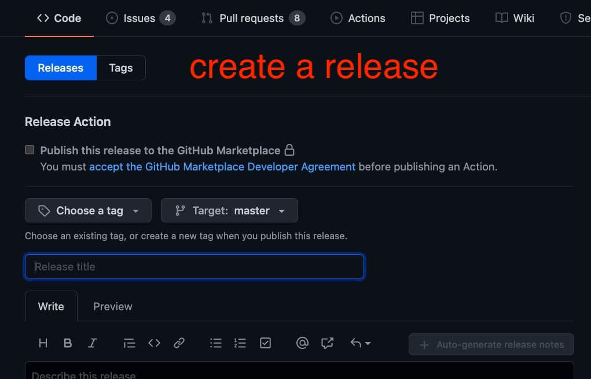
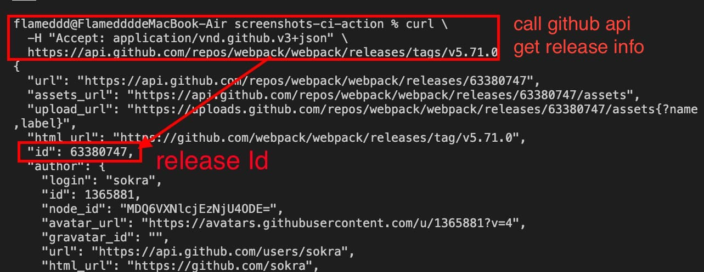
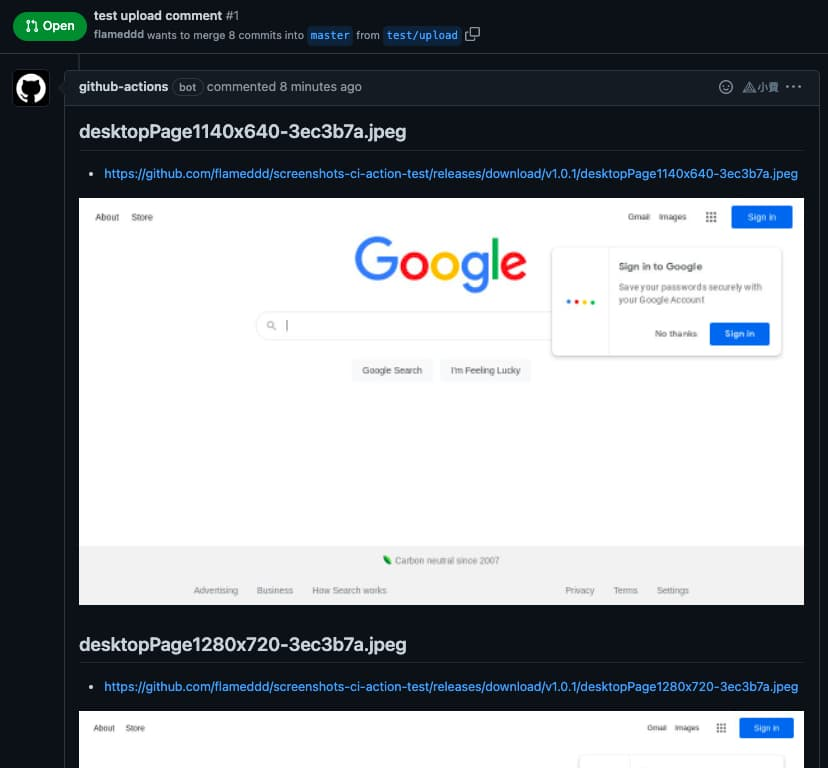

# screenshots-ci-actions upload and post image to PR comment

## 1. Prerequisites 
This feature leverage `Gtihub Release`, we need a `release Id`, either create a new release or use existed release
1. Create a repo release
    - release tag name are **NOT** important, you can name and add it whatever you want.
2. `curl` gtihub release endpoint to find out `release id`
    - `/repos/{owner}/{repo}/releases/tags/{tag}`
    - ref: https://docs.github.com/en/rest/reference/releases#get-a-release  
    - (let me know if you have easier way to figure out release id, I will update document, thanks)

```shell
curl \
  -H "Accept: application/vnd.github.v3+json" \
  https://api.github.com/repos/octocat/hello-world/releases/tags/TAG
```

e.x. webpack `v5.71.0` release: https://github.com/webpack/webpack/releases/tag/v5.71.0
```shell
curl \
  -H "Accept: application/vnd.github.v3+json" \
  https://api.github.com/repos/webpack/webpack/releases/tags/v5.71.0
```

  
  

## 2. Setting

Webhook events: `pull_request` hook are **requirement**
- ref: https://docs.github.com/en/developers/webhooks-and-events/webhooks/webhook-events-and-payloads#pull_request
```yaml
on:
  pull_request:
    types: [ opened, synchronize, reopened ]
```

Set `releaseId` parameters and `GITHUB_TOKEN` env
- GitHub automatically creates a unique `GITHUB_TOKEN` secret to use in your workflow.
- ref: https://docs.github.com/en/actions/security-guides/automatic-token-authentication

```yaml
- name: screenshots-ci-actions upload and post image to PR comment
  uses: flameddd/screenshots-ci-action@master
  with:
    url: https://www.google.com/
    releaseId: 63601424
  env:
   GITHUB_TOKEN: ${{ secrets.GITHUB_TOKEN }}
```


## 3. Full example
- Webhook: `pull_request`
- target URL: `https://www.google.com/`
- devices: `iPhone 6,iPhone 6 landscape`
- releaseId: `63601424`
- GITHUB_TOKEN: `${{ secrets.GITHUB_TOKEN }}`

```yaml
name: screenshots ci actions
on:
  pull_request:
    types: [ opened, synchronize, reopened ]

jobs:
  screenshots:
    runs-on: ubuntu-latest
    steps:
    - uses: actions/checkout@v2
    - name: install puppeteer-headful
      uses: mujo-code/puppeteer-headful@master
      env:
        CI: 'true'
    - name: screenshots-ci-action
      uses: flameddd/screenshots-ci-action@master
      with:
        url: https://www.google.com/
        devices: iPhone 6,iPhone 6 landscape
        releaseId: 63601424
      env:
        GITHUB_TOKEN: ${{ secrets.GITHUB_TOKEN }}
    - uses: actions/upload-artifact@v2
      with:
        path: screenshots
        name: Download-screenshots
```

  