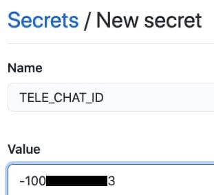
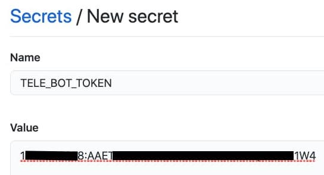
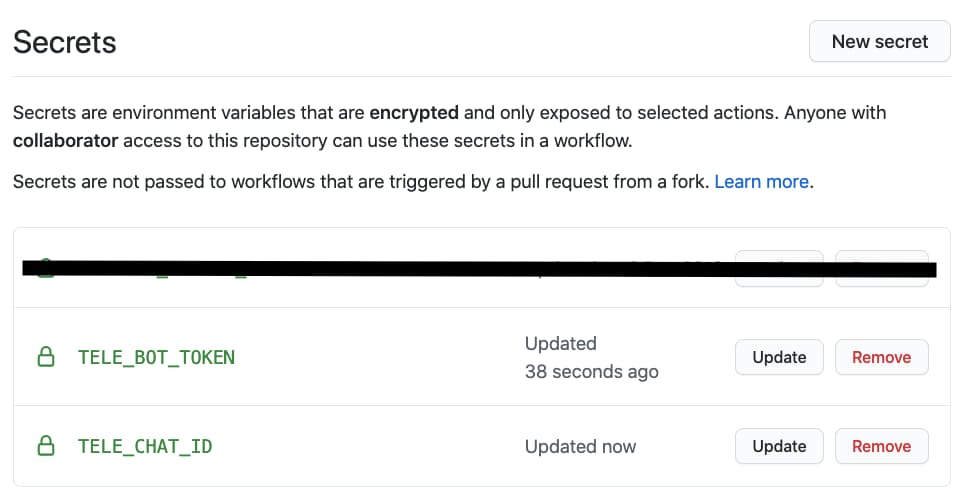
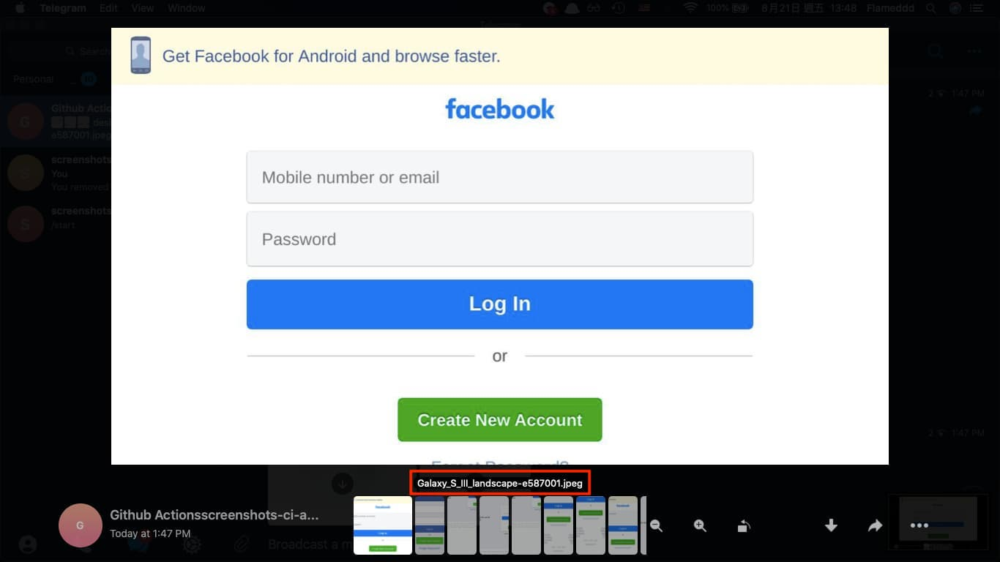
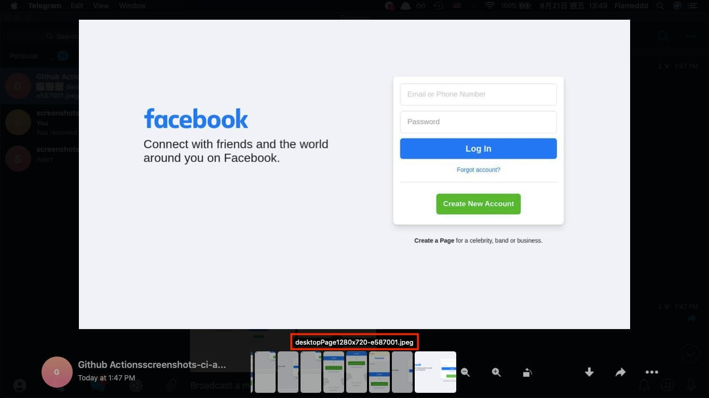
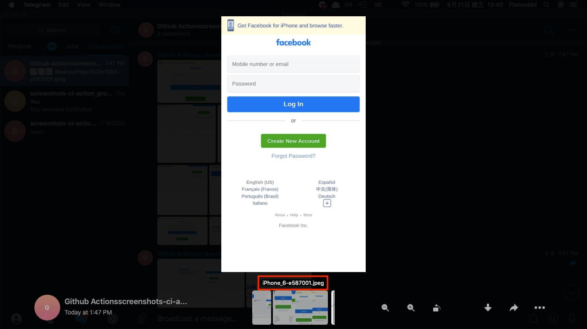

# Telegram screenshots-ci-action setting

## Prerequisites
1. Bot token
    - how to creat and get bot token: https://dev.to/rizkyrajitha/get-notifications-with-telegram-bot-537l
2. GroupId or ChannelId
    - how to get groupId: https://stackoverflow.com/a/38388851
    - how to get channelId: https://gist.github.com/mraaroncruz/e76d19f7d61d59419002db54030ebe35#gistcomment-3276103
    - **private channel**: make sure the **bot** has right to access it.

## 1. set repo `secrets`
Set `TELE_CHAT_ID` and `TELE_BOT_TOKEN` as repo secrets for security issue.

Follow doc to set secretes
- https://docs.github.com/en/actions/configuring-and-managing-workflows/creating-and-storing-encrypted-secrets
- set groupId (or channelId) as `TELE_CHAT_ID` secret
- set bot token as `TELE_BOT_TOKEN` secret


  
  

## 2. set workflow yaml (config example)

```yaml
env:
  TELE_CHAT_ID: ${{ secrets.TELE_CHAT_ID }}
  TELE_BOT_TOKEN: ${{ secrets.TELE_BOT_TOKEN }}
```

full example:
```yaml
name: screenshots ci actions
on:
  push:
    branches:
    - master

jobs:
  screenshots:
    runs-on: ubuntu-latest
    steps:
    - uses: actions/checkout@v2
    - name: install puppeteer-headful
      uses: mujo-code/puppeteer-headful@master
      env:
        CI: 'true'
    - name: screenshots-ci-action
      uses: flameddd/screenshots-ci-action@v1.1.1
      with:
        url: https://github.com
        devices: iPhone 6,iPhone 6 landscape
        noDesktop: true
      env:
        TELE_CHAT_ID: ${{ secrets.TELE_CHAT_ID }}
        TELE_BOT_TOKEN: ${{ secrets.TELE_BOT_TOKEN }}
```

  
  
  
  