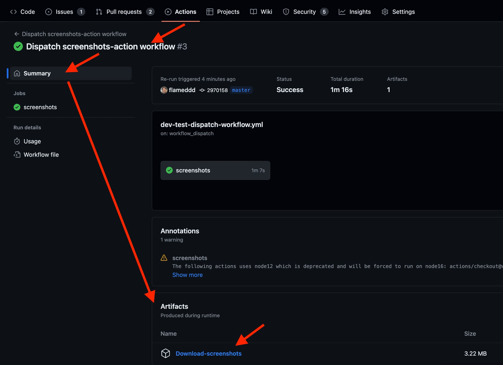
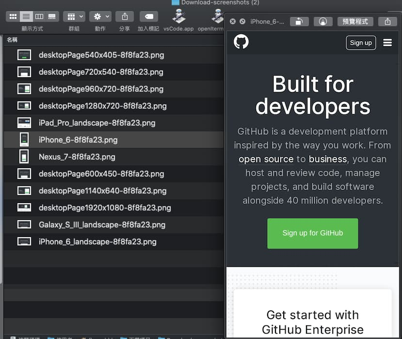
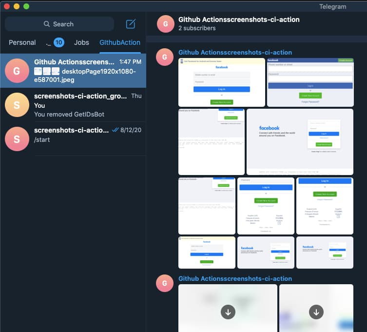
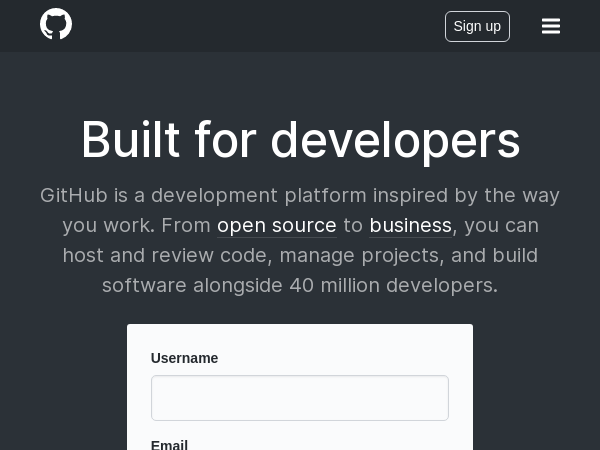
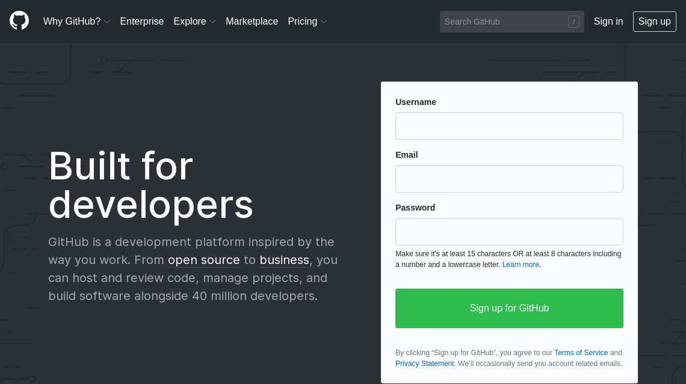
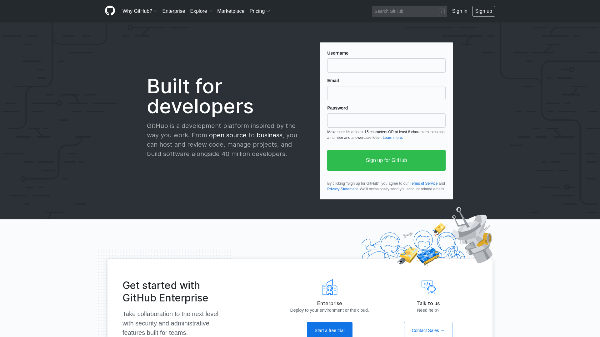
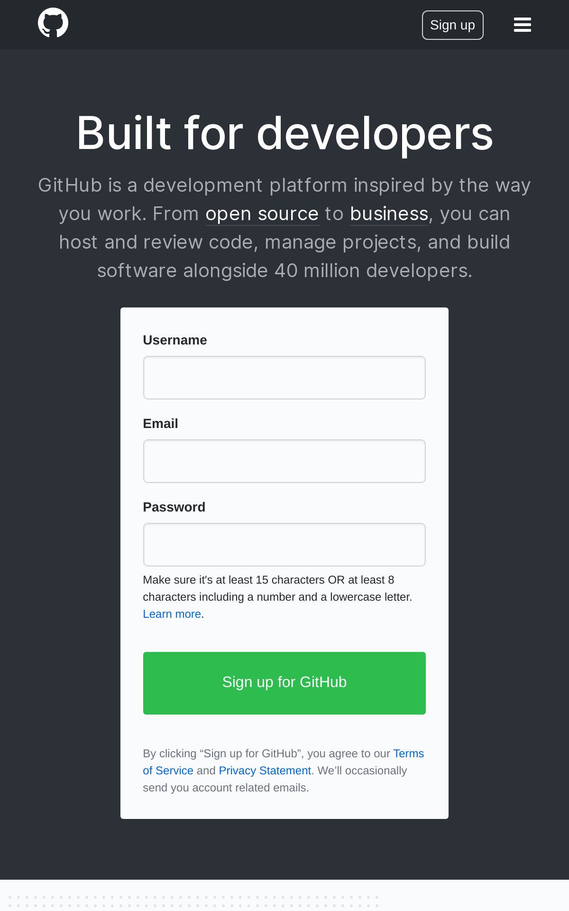

# screenshots-ci-action
Generate a website screenshots in different viewpoint, devices.
- **feel free to open issue to discuss your scenario**

## Parameters
| Name(type) | required(default) | Description |
| ------------- | ------------- | ------------- |
| `url`(string) | **required**(`""`) | The target website's URL to generate screenshots |
| `devices`(string) | optional(`""`) | Specific mobile devices to generate screenshots. **Use comma(`,`) to separate devices name.** Device name list in below. |
| `noDesktop`(boolean) | optional(`false`) | Set `true` if not require to get desktop viewpoint screenshots. |
| `fullPage`(boolean) | optional(`false`) | Set `true`, takes a screenshot of the full scrollable page. |
| `type`(string) | optional(`jpeg`) | Specify screenshot type, can be either `jpeg` or `png`. |
| `releaseId`(string) | optional(`"`) | Github Release Id, it's required to upload screenshots to PR comment. see [README.PR](/README.PR.md) for more detail |

## Envs
| Name(type) | required(default) | Description |
| ------------- | ------------- | ------------- |
| `TELE_CHAT_ID`(string) | optional(`""`) | Integration with **Telegram**. `screenshots-ci-action` will send screenshots to telegram. see [README.Telegram](/README.Telegram.md) for setting detail. (v1.1.1 added) |
| `TELE_BOT_TOKEN`(string) | optional(`""`) | Integration with **Telegram**. `screenshots-ci-action` will send screenshots to telegram. see [README.Telegram](/README.Telegram.md) for setting detail. (v1.1.1 added) |
| `GITHUB_TOKEN`(string) | optional(`""`) | Github Actions Tokens, it's required to upload screenshots to PR comment. see [README.PR](/README.PR.md) for more detail |

## Output screenshots
There are **3** different way to output files
1. Upload to **Actions Artifacts**
2. Send message to **Telegram** chat
3. Comment in **PR**

More full example in below

# Example 1 (screenshot desktop and few specific devices)
About this example:
- screenshot desktop and few specific devices
- Upload screenshots to **Actions Artifacts**

How to create new workflow
1. At the root of your repository, create a directory named `.github/workflows` to store your workflow files.
2. In `.github/workflows`, add a `.yml` or `.yaml` file for your workflow. For example, `.github/workflows/screenshots-workflow.yml`.

More workflow info:
- https://help.github.com/en/actions/configuring-and-managing-workflows/configuring-a-workflow

```yaml
name: screenshots ci actions
on:
  push:
    branches:
    - master # Trigger flow when something pushed to master branch

jobs:
  screenshots:
    runs-on: ubuntu-latest
    steps:
    - uses: actions/checkout@v2
    - name: install puppeteer-headful
      uses: mujo-code/puppeteer-headful@master # Required for headful puppeteer
      env:
        CI: 'true'
    - name: screenshots-ci-action
      uses: flameddd/screenshots-ci-action@master
      with:
        url: https://github.com
        devices: iPhone 6,iPhone 6 landscape,Nexus 7,Pad Pro,Galaxy S III landscape,iPad Pro landscape
    - uses: actions/upload-artifact@v2 # Uplaod screenshots to Actions Artifacts via actions/upload-artifact@v2
      with:
        path: screenshots
        name: Download-screenshots
```

# Example 2(screenshot iphone 6, without desktop)

```yaml
name: screenshots ci actions
on:
  push:
    branches:
    - master

jobs:
  screenshots:
    runs-on: ubuntu-latest
    steps:
    - uses: actions/checkout@v2
    - name: install puppeteer-headful
      uses: mujo-code/puppeteer-headful@master
      env:
        CI: 'true'
    - name: screenshots-ci-action
      uses: flameddd/screenshots-ci-action@master
      with:
        url: https://github.com
        devices: iPhone 6,iPhone 6 landscape
        noDesktop: true
    - uses: actions/upload-artifact@v2
      with:
        path: screenshots
        name: Download-screenshots
```

# Example 3 (multi URLs)
- URL 1: https://www.facebook.com/ (desktop)
- URL 2: https://m.facebook.com/   (mobile (iPhone 6))

```yaml
name: screenshots ci actions
on:
  push:
    branches:
    - master

jobs:
  screenshots:
    runs-on: ubuntu-latest
    steps:
    - uses: actions/checkout@v2
    - name: install puppeteer-headful
      uses: mujo-code/puppeteer-headful@master
      env:
        CI: 'true'
    - name: screenshots-desktop-facebook
      uses: flameddd/screenshots-ci-action@master
      with:
        url: https://www.facebook.com/
    - uses: actions/upload-artifact@v2
      with:
        path: screenshots
        name: Download-desktop-screenshots # Put URL1 screenshots into Download-desktop-screenshots
    - run: rm ./screenshots/* # Remove URL1 files

    - name: screenshots-mobile-facebook
      uses: flameddd/screenshots-ci-action@master
      with:
        url: https://m.facebook.com/
        devices: iPhone 6,iPhone 6 landscape
        noDesktop: true
    - uses: actions/upload-artifact@v2
      with:
        path: screenshots
        name: Download-mobile-screenshots # Put URL2 screenshots into Download-desktop-screenshots
```

# More examples (**Vercel**, **Netlify**)
- [**Vercel** Preview Deployment screenhots](/README.Vercel.md)
- [**Netlify** Preview Deployment screenhots](/README.Netlify.md)
- [Integration with **Telegram**](/README.Telegram.md)
- [Manually dispatch workflow](/README.workflow-dispatch.md)

# Download screenshots (more result example in below)



# Telegram


## Desktop: auto-create all of these ratio
- width: 540px, height: 405px
- width: 600px, height: 450px
- width: 720px, height: 540px
- width: 960px, height: 720px
- width: 1140px, height: 640px
- width: 1280px, height: 720px
- width: 1920px, height: 1080px

### Supported mobile devices options
- ref: https://github.com/puppeteer/puppeteer/blob/main/src/common/DeviceDescriptors.ts

||||
| :--- | :--- | :--- |
|'iPhone 4'<br />'iPhone 4 landscape'<br />'iPhone 5'<br />'iPhone 5 landscape'<br />'iPhone 6'<br />'iPhone 6 landscape'<br />'iPhone 6 Plus'<br />'iPhone 6 Plus landscape'<br />'iPhone 7'<br />'iPhone 7 landscape'<br />'iPhone 7 Plus'<br />'iPhone 7 Plus landscape'<br />'iPhone 8'<br />'iPhone 8 landscape'<br />'iPhone 8 Plus'<br />'iPhone 8 Plus landscape'<br />'iPhone SE'<br />'iPhone SE landscape'<br />'iPhone X'<br />'iPhone X landscape'<br />'iPhone XR'<br />'iPhone XR landscape'<br />'iPhone 11'<br />'iPhone 11 landscape'<br />'iPhone 11 Pro'<br />'iPhone 11 Pro landscape'<br />'iPhone 11 Pro Max'<br />'iPhone 11 Pro Max landscape'<br />'iPhone 12'<br />'iPhone 12 landscape'<br />'iPhone 12 Pro'<br />'iPhone 12 Pro landscape'<br />'iPhone 12 Pro Max'<br />'iPhone 12 Pro Max landscape'<br />'iPhone 12 Mini'<br />'iPhone 12 Mini landscape'<br />'iPhone 13'<br />'iPhone 13 landscape'<br />'iPhone 13 Pro'<br />'iPhone 13 Pro landscape'<br />'iPhone 13 Pro Max'<br />'iPhone 13 Pro Max landscape'<br />'iPhone 13 Mini'<br />'iPhone 13 Mini landscape'<br />|'iPad'<br />'iPad landscape'<br />'iPad (gen 6)'<br />'iPad (gen 6) landscape'<br />'iPad (gen 7)'<br />'iPad (gen 7) landscape'<br />'iPad Mini'<br />'iPad Mini landscape'<br />'iPad Pro'<br />'iPad Pro landscape'<br />'iPad Pro 11'<br />'iPad Pro 11 landscape'<br />|'Galaxy Note 3'<br />'Galaxy Note 3 landscape'<br />'Galaxy Note II'<br />'Galaxy Note II landscape'<br />'Galaxy S III'<br />'Galaxy S III landscape'<br />'Galaxy S5'<br />'Galaxy S5 landscape'<br />'Galaxy S8'<br />'Galaxy S8 landscape'<br />'Galaxy S9+'<br />'Galaxy S9+ landscape'<br />'Galaxy Tab S4'<br />'Galaxy Tab S4 landscape'<br />|
|'Pixel 2'<br />'Pixel 2 landscape'<br />'Pixel 2 XL'<br />'Pixel 2 XL landscape'<br />'Pixel 3'<br />'Pixel 3 landscape'<br />'Pixel 4'<br />'Pixel 4 landscape'<br />'Pixel 4a (5G)'<br />'Pixel 4a (5G) landscape'<br />'Pixel 5'<br />'Pixel 5 landscape'<br />|'Nexus 4'<br />'Nexus 4 landscape'<br />'Nexus 5'<br />'Nexus 5 landscape'<br />'Nexus 5X'<br />'Nexus 5X landscape'<br />'Nexus 6'<br />'Nexus 6 landscape'<br />'Nexus 6P'<br />'Nexus 6P landscape'<br />'Nexus 7'<br />'Nexus 7 landscape'<br />'Nokia Lumia 520'<br />'Nokia Lumia 520 landscape'<br />'Nokia N9'<br />'Nokia N9 landscape'<br />'Nexus 10'<br />'Nexus 10 landscape'<br />|'Blackberry PlayBook'<br />'BlackBerry Z30'<br />'BlackBerry Z30 landscape'<br /><br />'JioPhone 2'<br />'JioPhone 2 landscape'<br />'Kindle Fire HDX'<br />'Kindle Fire HDX landscape'<br />'LG Optimus L70'<br />'LG Optimus L70 landscape'<br />'Microsoft Lumia 550'<br />'Microsoft Lumia 950'<br />'Microsoft Lumia 950 landscape'<br />'Moto G4'<br />'Moto G4 landscape'<br />|

## Result examples
### desktop (600x450)


### desktop (960x720)


### desktop (1140x640)


### desktop (1920x1080)


### mobile (iPhone_6_landscape)


### mobile (iPhone_6)


### mobile (Nexus_7)


### mobile (iPhone_6, fullPage)
<p align="center">
  
