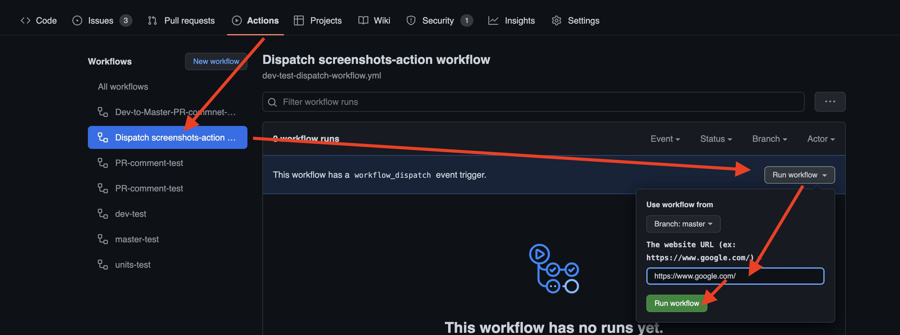

# Manually dispatch workflow

## 1. Follow example setup your workflow
```yaml
name: Dispatch screenshots-action workflow
on:
  workflow_dispatch:
    inputs:
      url:
        description: 'The website URL (ex: https://www.google.com/)'
        required: true
        default: ''

jobs:
  screenshots:
    runs-on: ubuntu-latest
    steps:
    - uses: actions/checkout@v2
    - name: install puppeteer-headful
      uses: mujo-code/puppeteer-headful@master
      env:
        CI: 'true'
    - name: screenshots-ci-action
      uses: flameddd/screenshots-ci-action@master
      with:
        url: ${{ github.event.inputs.url }}
    - uses: actions/upload-artifact@v2
      with:
        path: screenshots
        name: Download-screenshots
```

## 2. Go to Actions page, dispatch workflow
  


### More examples
1. Input target URL
2. setting mobile devices
    - (generate desktop and mobiles screenshots)

```yaml
name: Dispatch screenshots-action workflow
on:
  workflow_dispatch:
    inputs:
      url:
        description: 'The website URL (ex: https://www.google.com/)'
        required: true
        default: ''
      devices:
        description: 'Specific mobile devices. Use comma(,) to separate devices name. More info: https://github.com/flameddd/screenshots-ci-action'
        required: false
        default: ''

jobs:
  screenshots:
    runs-on: ubuntu-latest
    steps:
    - uses: actions/checkout@v2
    - name: install puppeteer-headful
      uses: mujo-code/puppeteer-headful@master
      env:
        CI: 'true'
    - name: screenshots-ci-action
      uses: flameddd/screenshots-ci-action@master
      with:
        url: ${{ github.event.inputs.url }}
        devices: ${{ github.event.inputs.devices }}
    - uses: actions/upload-artifact@v2
      with:
        path: screenshots
        name: Download-screenshots
```

Multiple URLs

```yaml
name: Dispatch screenshots-action workflow
on:
  workflow_dispatch:
    inputs:
      url1:
        description: 'The website URL (ex: https://www.google.com/)'
        required: true
        default: ''
      url2:
        description: 'The website URL (ex: https://stackoverflow.com/)'
        required: true
        default: ''

jobs:
  screenshots:
    runs-on: ubuntu-latest
    steps:
    - uses: actions/checkout@v2
    - name: install puppeteer-headful
      uses: mujo-code/puppeteer-headful@master
      env:
        CI: 'true'
    - name: screenshots-url1-action
      uses: flameddd/screenshots-ci-action@master
      with:
        url: ${{ github.event.inputs.url1 }}
    - uses: actions/upload-artifact@v2
      with:
        path: screenshots
        name: Download-url1-screenshots
    - run: rm ./screenshots/*

    - name: screenshots-url2-action
      uses: flameddd/screenshots-ci-action@master
      with:
        url: ${{ github.event.inputs.url2 }}
        devices: iPhone 6,iPhone 6 landscape
        noDesktop: true
    - uses: actions/upload-artifact@v2
      with:
        path: screenshots
        name: Download-url2-screenshots
    - run: rm ./screenshots/*
```
